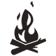
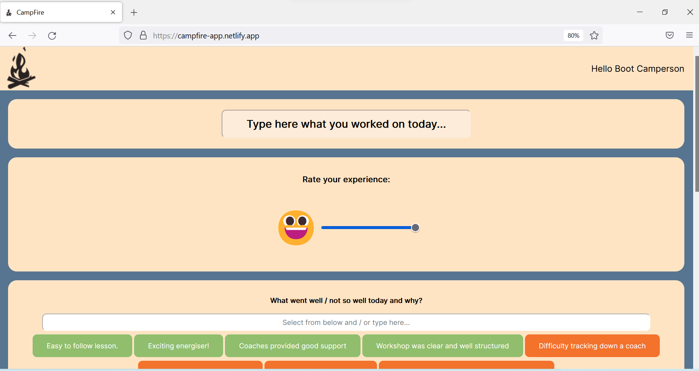
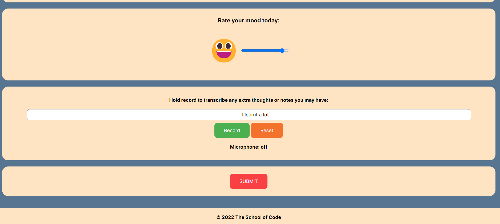
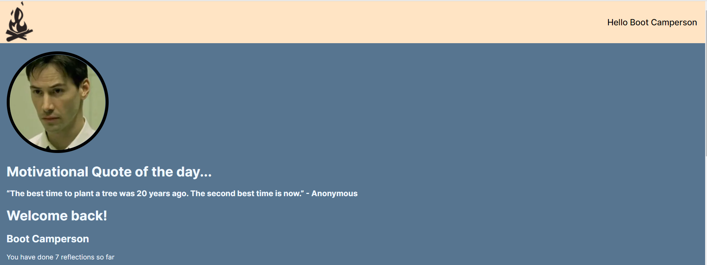
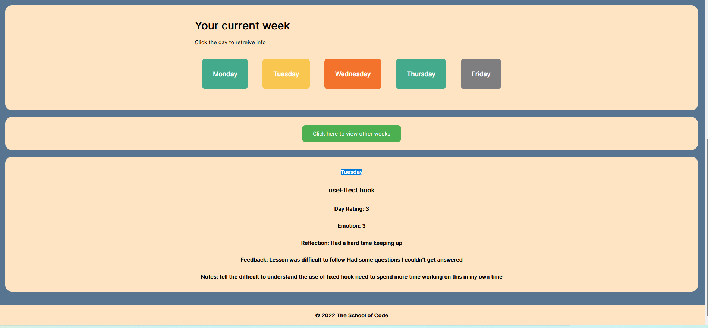

 

# Campfire.

>An app for bootcamper reflection and progress tracking at School of Code.

## Motivation.

As a part of the Bootcamp at School of Code, the bootcampers are challenged to create an MVP front-end app that improves an aspect of the Bootcamp in one week in teams of four members. This app is the result of the efforts of Antony (ajp64), Dan (Dan-Sutton), Ben (benmhcode), and me working together during that week.

We realised that after an intense day of coding, people are less inclined to fill out multiple forms requiring text input. Because of this, Bootcampers are engaging with the forms less than would be preferred. 
In addition, there is no way for the bootcamper to review and look back on the forms in one place. If they had this, it would be easier to keep track of where they are on their journey and what else they need to do to keep on track.

Also some Bootcampers we spoke to had previously spent up to an extra hour completing the forms - this can happen when there is a language barrier. We want to provide a quick and efficient way to gain valuable insight into a bootcamper's experience.
## Description.
In the frontend Campfire app has an intuitive form that is filled in quickly by typing the subject that the bootcamper wants to give feedback on and selecting the corresponding buttons. Also, it allows them to give feedback on their mood by a slide bar and use the microphone to record any thoughts or notes.
Once the form is submitted, the information is stored in a database in the backend and the bootcamper can review the previous information submitted throughout the week.

>Feedback form.

>Dashboard.

